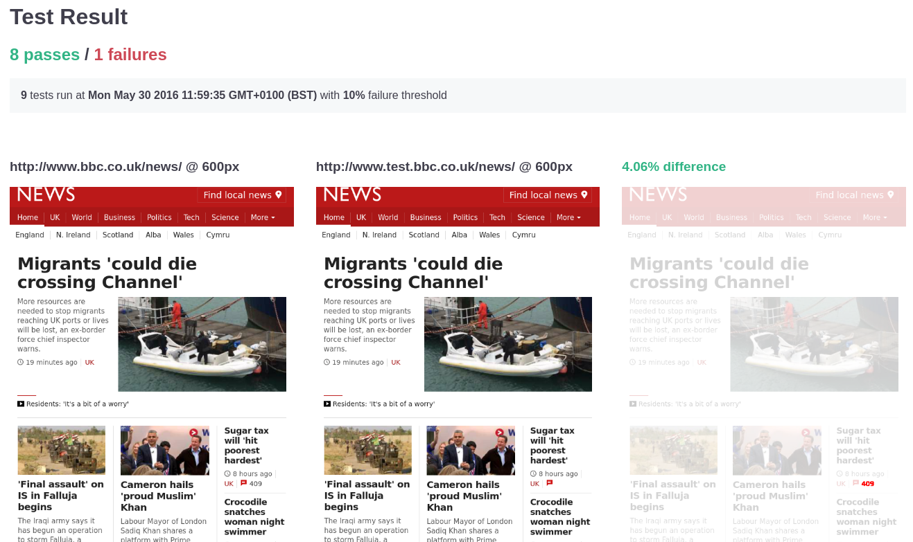

# Whoopsie

[](https://travis-ci.org/wildlyinaccurate/whoopsie)
[](https://coveralls.io/repos/github/wildlyinaccurate/whoopsie/badge.svg?branch=master)

Whoopsie is a visual regression tool for testing responsive web sites.

## Installation

```
$ npm install -g whoopsie
```

> **Note:** A recent version of ImageMagick is required to run Whoopsie.

## Usage

```
$ whoopsie gallery path/to/config.yaml
```

## Docker

If you prefer to run Whoopsie in a container, you can use the official Docker image:

```
$ docker pull wildlyinaccurate/whoopsie
$ docker run --rm --volume $PWD:/whoopsie --workdir /whoopsie \
    wildlyinaccurate/whoopsie \
    whoopsie gallery /whoopsie/path/to/config.yaml
```

### Options

| Name            | Default value      | Description                          |
|-----------------|--------------------|--------------------------------------|
| `--concurrency` | `os.cpus().length` | Number of tests to run concurrently  |
| `--verbose`     | `<Off>`            | Enable verbose output                |

> **Note:** Whoopsie requires Node.js v6.0 or higher to run.

## Configuration

See [config/sample.yaml](./config/sample.yaml) for a sample configuration file.

## Example Output

[](./example-output.png)

## License

[ISC](./LICENSE)
